# PXIシステムをLinuxで運用する

## Hello👋 > 💻:===:💻 < Hi👋

---

## はじめに

### PXIとは

> PXIはテストエンジニア用コンピュータです。これは、マルチスロットシャーシにコントローラと計測器を組み合わせたテストおよび計測用プラットフォームです。エンジニアはNI PXIを使用して、検証と製造テストのための高性能な複合測定システムを構築します。

つまり、OSを搭載した万能計測器。やばすぎ🤯

### 主な構成パーツ

- シャーシ

> シャーシはPXIシステムの基幹部分であり、PCの機械的な筐体およびマザーボードに相当します。これが電源、冷却、通信バスを提供し、計測器モジュールを同期します。シャーシのスロット数は4～18と種々のサイズがあり、ポータブル、ベンチトップ、ラックマウント、組み込みシステムなど、さまざまな用途とニーズに対応しています。

イメージとしては、デスクトップPCのマザーボードと筐体が一体化したようなもの。シャーシに各種コンポーネントを取り付けてカスタマイズできる。

- コントローラ

> PXIコントローラには、組込コントローラとリモートコントローラがあります。組込コントローラは、リモートコントローラでPXIシステムをデスクトップ、ノートブック、サーバコンピュータから制御できる一方、外部PCなしでPXIシステムを実行するのに必要なすべてが含まれています。ニーズに合ったコントローラを選択してください。組み込みコントローラは性能が高く、リモートコントローラはコストパフォーマンスが高くなります。

要はコンピュータ本体として機能する部分。ここには一般的なパソコン同様にCPU, RAM, Storage, NIC, Display Portなどの各インターフェースがひとつのコンポーネントとして提供される。ここだけなら本当にただのパソコン。

- モジュール

> NIでは、DCからミリ波まで、600以上の入出力PXIモジュールを提供しています。その中には、オシロスコープやデジタルマルチメータなどのモジュール式計測器が含まれます。オープンな業界規格であるPXIは、60社を超える計測器ベンダがおよそ1,500種類の製品を提供しています。

PXIシステムの計測器全般を指す。用途に応じて使い分けるっぽい。

---

## PXIシステムの概要

以降はPXIコントローラのことを単にPXIと表記します。（例: PXIにUbuntu 22.04をインストール）

- シャーシ:
  - PXIe-1092
- コントローラ:
  - PXIe-8862
- モジュール:
  - PXIe-4481
  - PXIe-5163
  - PXIe-6739
- OS:
  - Ubuntu Server 22.04 LTS
- NI Driver
  - [README(LTSはまだ出てない)][NI Linux Device Drivers 2023 Q3 Readme]

---

## PXIにUbuntuをインストール

- Ubuntu Desktop/Serverのイメージをダウンロード
  [公式](https://jp.ubuntu.com/download)からLTS版をインストール
- ISOファイルをUSBに書き込んで起動USBを作成(Windows: rufus, Mac: Etchar)
- BIOSを開く（deleteキーで入れた）
  - BIOSで起動順序をUSBに変更
    ただしこれだけでは上手く起動できない
  - secure bootの項目をcustomからstandardに変更
    やはりセキュアブートは悪、滅ぶべし
- Ubuntuのインストーラが起動したら言う通りに基本セットアップをする
  ※ 最小インストールが望ましい
- 再起動し、起動USBを抜いてインストール完了

---

## NI DriverをUbuntuにセットアップ

別に手動でやるような作業じゃないから...気が向いたらshell書いておきます。

- `sudo apt -y update`, `sudo apt dist-upgrade`を実行して最新版のカーネルにアップデート
- `reboot`で再起動
- `curl -O https://download.ni.com/support/softlib/MasterRepository/LinuxDrivers2024Q1/NILinux2024Q1DeviceDrivers.zip`を実行してLinuxデバイスドライバリポジトリ登録パッケージをダウンロード
- `sudo apt -y install unzip` を実行
- `unzip NILinux2024Q1DeviceDrivers.zip`を実行して解凍
- `sudo apt install /home/researcher/NILinux2024Q1DeviceDrivers/ni-ubuntu2204-drivers-2024Q1.deb`を実行してリポジトリ登録パッケージをインストール
  ※ filename.debは任意のパッケージを使用
  ※ なぜか絶対パスじゃないと動かなかった、なんで？
- `sudo apt -y install filename`で使用するNIドライバをインストール
- `reboot`で再起動

今回の構成のドライバと必要なパッケージは以下の通りです。

| Driver   | Package                  |
|----------|--------------------------|
| NI-DAQmx | ni-daqmx                 |
| NI-SCOPE | ni-scope, ni-scope-daqmx |

参考リンク

- [NI 製品をインストールする (Ubuntu)]
- [LinuxデスクトップにNI のドライバとソフトウェアをインストールする]
- [Linuxディストリビューションでサポートされているドライバパッケージ]

---

## Ubuntuのネットワーク設定

システムの概要図は[Fig 1]みたいな感じ。クライアントとなるデスクトップPC（左）とここまで設定を行ってきたPXI（右）とが、直接LANケーブルによって接続されています。
これだけで立派なネットワークを確立することができるのだから、やはりコンピュータは素晴らしい！

ここからの作業は一般的なUbuntu Serverを構築する時と変わらない[^1]のでサクサク進めよう！



[Fig 1]: network.svg

### まずはじめにnetplanあり

- 基本はここから、PXIのIPアドレスをDHCPから固定に変更する
- 必要なツールのインストール
  最小インストールはvimやnanoなどのテキストエディタすら入っていないのだ！

```bash
sudo apt -y install inetutils-ping &&\
sudo apt -y install netcat &&\
sudo apt -y install tcpdump &&\
sudo apt -y install ufw &&\
sudo apt -y install openssh-server &&\
sudo apt -y install nano
```

- `sudo nano /etc/netplan/00-installer-config.yaml`でUbuntuのネットワーク設定を行う（viでも可）
- 以下の設定を行う（$X, Y \in \mathbb{N} \ | \ 1 < X < 256, 1 < Y < 256$）
  
```yaml
network:
ethernets:
  eno0:
    dhcp4: true
    dhcp6: false
  eno1:
    dhcp4: false
    dhcp6: false
    addresses:
    - 192.168.X.Y/24
    nameservers:
      addresses: []
      search: []
version: 2
```

- 編集内容を保存したら`sudo netplan apply`を実行して変更を適用する
- `ip a`を実行して設定が適応されているか確認する

```bash
$ ip a
1: lo: <LOOPBACK,UP,LOWER_UP> mtu 65536 qdisc noqueue state UNKNOWN group default qlen 1000
    link/loopback 00:00:00:00:00:00 brd 00:00:00:00:00:00
    inet 127.0.0.1/8 scope host lo
      valid_lft forever preferred_lft forever
    inet6 ::1/128 scope host 
      valid_lft forever preferred_lft forever
2: eno1: <BROADCAST,MULTICAST,UP,LOWER_UP> mtu 1500 qdisc mq state UP group default qlen 1000
    link/ether 00:80:2f:38:b4:68 brd ff:ff:ff:ff:ff:ff
    altname enp112s0
    inet 192.168.200.200/24 brd 192.168.200.255 scope global eno1
      valid_lft forever preferred_lft forever
    inet6 fe80::280:2fff:fe38:b468/64 scope link 
      valid_lft forever preferred_lft forever
```

うむうむ、良きかな👍

### Firewallを設定する

- `sudo apt-get update` `sudo apt -y install ufw`を実行する
- `sudo ufw enable`でファイアウォールを起動する
- `sudo ufw default deny`を実行して全てのポートを無効にする
- `sudo ufw allow <port num>`で任意のポート番号を許可する
- `sudo ufw status numbered`を実行すると現在のファイアウォールの設定を確認することができる

### VSCodeからSSHでリモート接続できるようにしよう

PXIに対して別のパソコンからSSHを用いてリモート接続できるようにします。すると、リモートからVSCodeを使った編集が可能となります。やったね👍
まあ、ローカルで使うのであまり必要ないかも。忙しい人はここは飛ばしてもいいです。

- PXIに接続したいパソコン（あなたが普段使っているWindowaやMac）に[VSCodeをインストール](https://code.visualstudio.com/download)します
  ※インストール済みの人はスルーで
- VSCodeの拡張機能で"remote"と検索すると、一番上に”[Remote Development](https://marketplace.visualstudio.com/items?itemName=ms-vscode-remote.vscode-remote-extensionpack)”という拡張機能のパッケージが出てくるので、これをインストール
- リモートエクスプローラーというバッジが増えているので、クリックしてメニューを開き、SSHと書かれたトグルリストの歯車マークをクリックしてSSH構成ファイルを開く
- `SSH config` ファイルが開くので、必要なホスト情報を記述する。初回はパスワードログインなので公開鍵の設定は必要なし
  
```bash:config
Host PXISystem
    HostName <PXI IPv4 address>
    User <接続先のUsername>
    Port <Firewallで開放したポート番号>
```

- PXIシステムのネットワーク（192.168.200.0）に接続
  方法は有線無線なんでも良い

```text:Network
192.168.200.0
├── PXISystem: 192.168.200.200
├── Desktop PC: 192.168.200.201
└── Laptop PC: 192.168.200.XXX <- VSCode
```

- リモートエクスプローラーを更新すると、ホスト名が表示されたトグルリストが出現するので、接続をクリックします
  ※ここでうまくいかない人は[付録](#openssh-serverの設定)の方法を試してください
- 初回は接続先ホストのOSを聞かれるので、 Linuxを選択
- パスワードを求められたら。接続先のパスワードを入力

お疲れ様でした！これで一通りサーバを運用する前準備が完了しました。わーい🙌

---

## WebSocketによる同期処理

[Dockerを使用したコンテナ間通信]

### WebSocketでサーバ・クライアント間のやりとりを自動化させる

1. bashとpythonを使用した実行
2. 2台のサーバ（GPUサーバとPXIシステム）を一本の線（LAN、SFT）で接続
3. systemdにデーモンを登録 - [参考リンク][Systemdを使ってさくっと自作コマンドをサービス化してみる]

---

<!-- ## ansibleで自動セットアップまでできたらいいな

--- -->

## おまけ

全部書くと長すぎるかなと思ったので、細かい話はこっちに補足しておきます。

### OpenSSH Serverの設定

[Firewallを設定する](#firewallを設定する)で開放するポート番号を指定した場合、SSHの設定を変更する必要があります。SSHされる側、つまりPXISystemにはsshdというデーモンが動いています。この子が見張っているポート番号はデフォルトで22番です。しかし、あなたはつい先程Firewallを稼働させて自分で指定したポート番号以外を塞いでしまいました。なので、sshdのコンフィグファイルを変更する必要があります。ついでに設定を変更してセキュリティ対策もしておきましょう。

- `sudo nano /etc/ssh/sshd_config` を実行し、編集画面に移ります
- 次の項目を変更しておきましょう

```config:sshd_config
Port <Firewallで開放したポート番号>
PermitRootLogin no
PermitEmptyPasswords no
```

- 完了したら保存して、`sudo systemctl restart sshd`を実行してsshdを再起動させて設定を反映させる

### Dockerを使用したコンテナ間通信

ここでは、Dockerでコンテナを２つデプロイしてサーバ間通信の検証環境を構築します。
Dockerを使用する理由は、本番環境にデプロイする前にテスト環境で動作確認を行いたいためです。  
チャレンジしてみたい人は実際にコンテナを作成して通信が行われるか検証してみましょう。💪

- `docker network create <Docker Network Name>`を実行して任意のDockerネットワークを作成
- `docker network inspect <Docker Network Name>`を実行して詳細を確認

```bash
$ docker network inspect <Docker Network Name>
[
    {
        "Name": "<Docker Network Name>",
        "Id": "abcdefg",
        "Created": "XXXX-XX-XXTXX:XX:XX.XXXXXXXXX",
        "Scope": "local",
        "Driver": "bridge",
        "EnableIPv6": false,
        "IPAM": {
            "Driver": "default",
            "Options": {},
            "Config": [
                {
                    "Subnet": "XXX.XXX.XXX.XXX/16",
                    "Gateway": "XXX.XXX.XXX.1"
                }
            ]
        },
        "Internal": false,
        "Attachable": false,
        "Ingress": false,
        "ConfigFrom": {
            "Network": ""
        },
        "ConfigOnly": false,
        "Containers": {},
        "Options": {},
        "Labels": {}
    }
]
```

- `Dockerfile`から`Build image`を実行してイメージを作成

```bash
What's Next?
  View a summary of image vulnerabilities and recommendations → docker scout quickview
 *  ターミナルはタスクで再利用されます、閉じるには任意のキーを押してください。 
```

- `docker-compose.yaml`から`Compose Up`を実行してコンテナをデプロイ

```bash
[+] Running 2/0
 ✔ Container pxi      Running                                                                                                                                                            0.0s 
 ✔ Container desktop  Running                                                                                                                                                            0.0s 
 *  ターミナルはタスクで再利用されます、閉じるには任意のキーを押してください。
```

- `docker ps`または`docker container ls`を実行して通信に必要な情報を取得します

```bash
$ docker ps
CONTAINER ID   IMAGE        COMMAND       CREATED         STATUS         PORTS     NAMES
c7c2d86e93e7   tcp:latest   "/bin/bash"   5 seconds ago   Up 4 seconds             desktop
8a488c97c79c   tcp:latest   "/bin/bash"   5 seconds ago   Up 4 seconds             pxi
```

- `docker inspect ${Container名}`を実行するとデプロイしたコンテナの詳細情報を確認できる
- VSCodeにDockerの拡張機能から、実行中の2つコンテナをそれぞれ選択して`Attach Shell`をクリック

```bash
root@desktop:~# 
# こんな感じのターミナルが起動する
```

```bash
root@pxi:~# 
# こんな感じのターミナルが起動する
```

- `nc`コマンドを使用して、相互通信が可能か確認

```bash
# クライアント側
root@desktop:~# nc -t XXX.XXX.XXX.a 8080
Hello!
```

```bash
# サーバ側
root@pxi:~# nc -l -p 8080
Hello!
```

これでTCP通信がコンテナ間でできるようになりました🙌
成し遂げたぜ！

---

## 参考文献

1. [NI Linux Device Drivers 2023 Q3 Readme]
2. [NI 製品をインストールする (Ubuntu)]
3. [LinuxデスクトップにNI のドライバとソフトウェアをインストールする]
4. [Linuxディストリビューションでサポートされているドライバパッケージ]
5. [Systemdを使ってさくっと自作コマンドをサービス化してみる]

[NI Linux Device Drivers 2023 Q3 Readme]: https://www.ni.com/pdf/manuals/ni-linux-device-drivers-2023-q3.html
[NI 製品をインストールする (Ubuntu)]: https://www.ni.com/docs/ja-JP/bundle/ni-platform-on-linux-desktop/page/installing-ni-products-ubuntu.html
[LinuxデスクトップにNI のドライバとソフトウェアをインストールする]: https://www.ni.com/docs/ja-JP/bundle/ni-platform-on-linux-desktop/page/installing-ni-drivers-and-software-on-linux-desktop.html
[Linuxディストリビューションでサポートされているドライバパッケージ]: https://www.ni.com/docs/ja-JP/bundle/ni-platform-on-linux-desktop/page/supported-drivers-for-linux-distributions.html
[Systemdを使ってさくっと自作コマンドをサービス化してみる]: https://qiita.com/DQNEO/items/0b5d0bc5d3cf407cb7ff

[^1]: 今回のネットワークにはルータやDNSサーバが存在しません。それゆえnetplanの設定で不要な部分は排除していることに注意してください。
